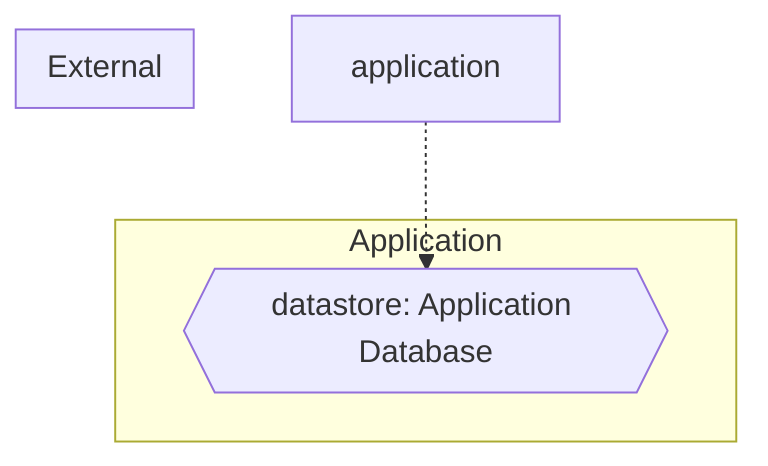

# Threat Model (auto-generated)

Generated by agentic-security on 2026-08-20.

This threat model is derived from static analysis of the current codebase and is regenerated on every scan. It is intended as a working artifact, not a finished compliance document.

## Entities + boundaries

## Assets

- **datastore**: Application Database — at `(global)`

## STRIDE threats

### Tampering (1)

- [high] **sql-injection** (CWE-89) at `validate_reports.py:33` — SQL Injection (f-string SQL assigned to variable)

### Information Disclosure (1)

- [high] **sql-injection** (CWE-89) at `validate_reports.py:33` — SQL Injection (f-string SQL assigned to variable)

## Attack trees

### Compromise datastore: Application Database
Severity rollup: **high**

- [high] Tampering via sql-injection (CWE-89) — `validate_reports.py:33`
- [high] Information Disclosure via sql-injection (CWE-89) — `validate_reports.py:33`
